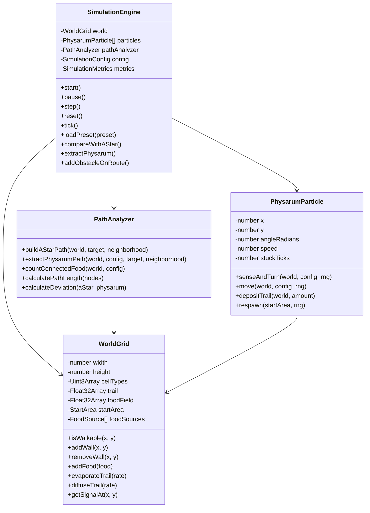
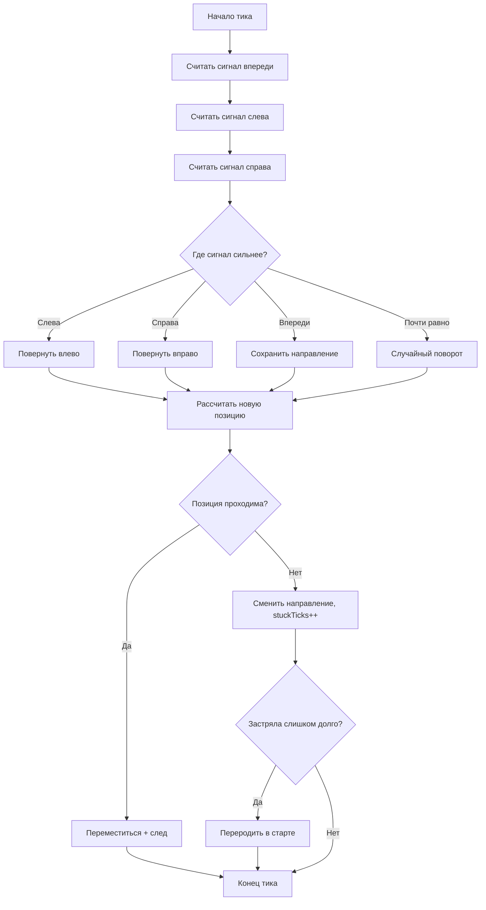
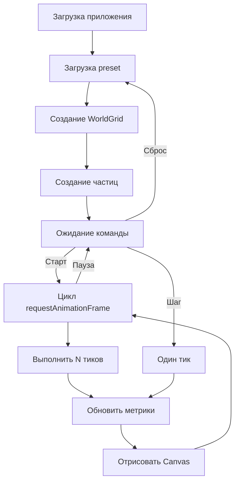

# Архитектура Physarum Lab

## 1. Общая архитектура

Приложение разделено на два слоя:

1. **Слой модели и симуляции** — чистая TypeScript-логика без зависимости от React (`src/model`, `src/algorithms`, `src/rendering`, `src/config`, `src/types`, `src/utils`). Тестируется отдельно от UI.
2. **Слой интерфейса** — React-компоненты и Canvas-отрисовка (`src/app`, `src/components`).

React-компоненты не содержат бизнес-логики симуляции: они отображают состояние, вызывают методы движка через хук `useSimulation` и переключают визуальные слои. Вся логика движения частиц, следа, A*, извлечения маршрутов и метрик находится в слое модели.

```text
┌──────────────────────── UI (React) ────────────────────────┐
│ App → ControlPanel / ParameterPanel / MetricsPanel / ...     │
│        ▲                         │                           │
│        │ ui-state                │ actions                   │
│   ┌────┴─────────────────────────▼────┐                      │
│   │        useSimulation (хук)         │                      │
│   └────┬──────────────────────┬────────┘                     │
└────────┼──────────────────────┼──────────────────────────────┘
         │ управляет            │ рисует
         ▼                      ▼
   SimulationEngine ──────► CanvasRenderer
     │   │     │
     ▼   ▼     ▼
 WorldGrid  PhysarumParticle[]  PathAnalyzer ──► algorithms/astar
```

## 2. Четыре основных класса модели

### `SimulationEngine` (`src/model/SimulationEngine.ts`)
Главный управляющий класс. Хранит `WorldGrid`, массив `PhysarumParticle`, `PathAnalyzer` и конфигурацию. Управляет тиками (`tick`, `advance`, `step`), запуском/паузой/сбросом, загрузкой preset, сбором метрик, сравнением с A*, извлечением маршрута Physarum, динамическими препятствиями и экспортом. Воспроизводимость обеспечивается seed-генератором `SeededRandom`.

### `WorldGrid` (`src/model/WorldGrid.ts`)
Двумерная среда. Хранит типы клеток (`Uint8Array`), карту следа и пищевое поле (`Float32Array`), стартовую область и источники питания. Отвечает за проходимость, добавление/удаление стен и еды, испарение и диффузию следа (двойная буферизация), чтение сигналов.

### `PhysarumParticle` (`src/model/PhysarumParticle.ts`)
Частица-агент. Хранит координаты, угол, скорость и счётчик застревания. Методы: `senseAndTurn` (сенсорная стадия), `move` (двигательная стадия и столкновения), `depositTrail`, `respawn`.

### `PathAnalyzer` (`src/model/PathAnalyzer.ts`)
Анализ маршрутов. Строит эталонный A* до источника, извлекает кратчайший путь внутри активной сети следа, считает длину/отклонение/эффективность, покрытие карты, связность источников (flood fill) и базовую сетевую оценку для нескольких источников.

> React-компоненты, TypeScript-типы, утилиты, рендерер и тесты не считаются основными классами предметной модели.

## 3. Жизненный цикл тика симуляции

```ts
tick():
  world.updateFoodAttractionField(strength, radius)   // 1. пищевое поле
  for p in particles: p.senseAndTurn(world, config)    // 2. сенсорная стадия
  for p in particles:                                   // 3. двигательная стадия
      moved = p.move(world, config)
      if moved: p.depositTrail(world, depositAmount)    // 4. оставить след
  world.evaporateTrail(evaporationRate)                 // 5. испарение
  world.diffuseTrail(diffusionRate)                     // 6. диффузия
  detectFirstFood()                                     // 7. фиксация достижения
  tickNumber++
```

Тяжёлые метрики (связность, покрытие) пересчитываются не каждый кадр, а раз в `METRICS_RECALC_INTERVAL` тиков (по умолчанию 15) — это требование производительности.

## 4. Цикл рендеринга

`useSimulation` запускает `requestAnimationFrame`-цикл: измеряет FPS, при `running` вызывает `engine.advance(speed)` (учитывает дробные скорости через накопитель), затем `CanvasRenderer.render`. Состояние модели зеркалируется в React-state раз в ~150 мс для перерисовки панелей.

## 5. Почему логика отделена от UI

- **Тестируемость**: модель проверяется unit-тестами без DOM.
- **Производительность**: модель работает с типизированными массивами и не вызывает ре-рендеры React на каждый тик.
- **Сопровождаемость**: магические числа вынесены в `config/`, логика — в `model/`/`algorithms/`.

## 6. UML-диаграммы

### Диаграмма классов



### Диаграмма деятельности частицы



### Диаграмма жизненного цикла симуляции


