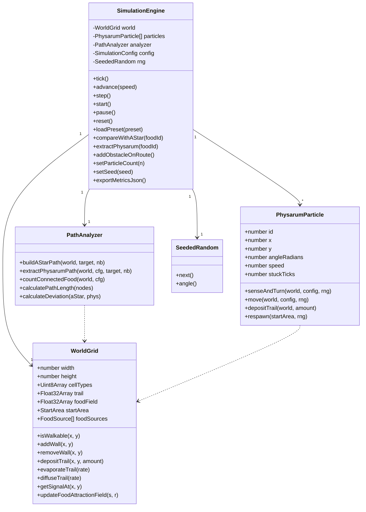
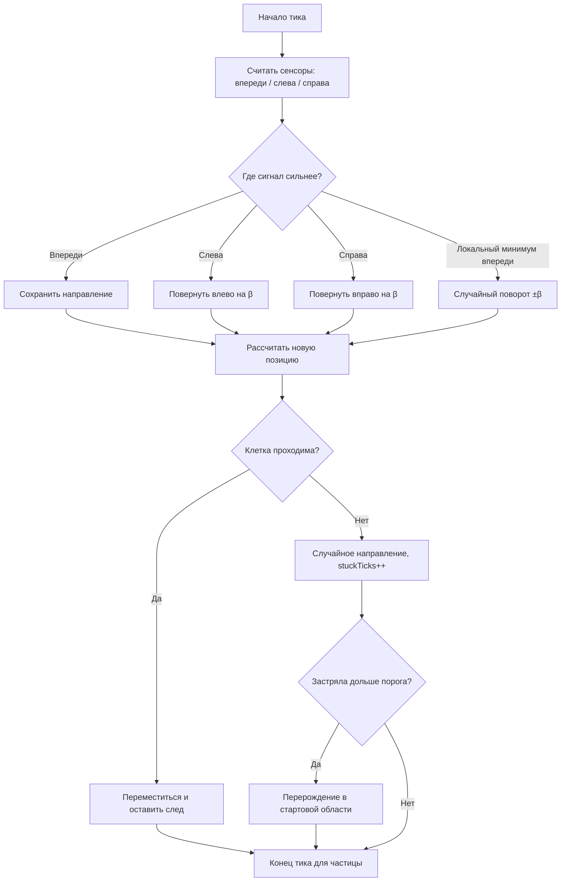
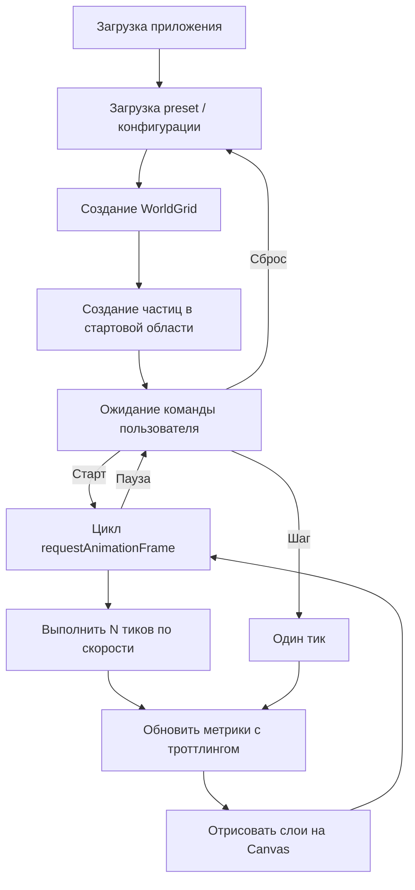

# Техническая документация проекта «Physarum Lab»

> Документ-основа для отчёта по практике. Структура повторяет требования к
> отчёту (ТЗ → проект → описание ПО → заключение → приложения). Разделы можно
> переносить в итоговый отчёт напрямую; места, требующие персональных данных и
> скриншотов, помечены как «‹заполнить›».

---

## Титульный лист (заготовка)

```
Федеральное государственное бюджетное образовательное учреждение
высшего образования «‹наименование вуза›»
Факультет (институт): ‹…›
Кафедра: ‹…›

ОТЧЁТ ПО ПРАКТИКЕ
Вид практики: технологическая (проектно-технологическая)
Направление подготовки: 09.03.04 Программная инженерия
Тема: «Имитационное моделирование самоорганизации Physarum polycephalum
       при поиске эффективных маршрутов в двумерной среде с препятствиями»

Студент: ‹Фамилия Имя Отчество›, группа ‹…›
Руководитель практики: ‹…›
Город, год
```

---

## Аннотация

Отчёт описывает разработку интерактивной программной имитационной модели
**«Physarum Lab»**, воспроизводящей самоорганизацию плазмодия слизевика
*Physarum polycephalum* при поиске эффективных маршрутов в двумерной среде с
препятствиями. Отчёт содержит техническое задание, математическую модель,
объектную модель (диаграмму классов и диаграммы деятельности), описание
программного продукта (модель и пользовательский интерфейс), результаты
тестирования и экспериментов.

Программа реализована на TypeScript с использованием React и отрисовкой на HTML
Canvas 2D. Глобальное поведение (транспортная сеть «вен») не задаётся явно, а
**возникает** из локальных правил отдельных агентов — это классический пример
агентного имитационного моделирования с эмерджентностью. В модель встроено
сравнение результата с эталонным алгоритмом A\*, набор настраиваемых параметров,
preset-сценарии (включая реконструкцию опыта Tero et al. с картой региона
Токио), экспорт метрик и автоматические тесты.

Отчёт содержит ‹N› страниц, ‹N› рисунков, ‹N› источников. Исходный код размещён
в репозитории (Приложение Б).

---

## Оглавление

- Введение
- 1. Техническое задание
  - 1.1. Терминология
  - 1.2. Описание процесса функционирования модели
  - 1.3. Требования к функциональности программы
- 2. Проект программного продукта
  - 2.1. Математическая модель
  - 2.2. Диаграмма классов
  - 2.3. Жизненный цикл объектов модели
- 3. Описание программного продукта
  - 3.1. Выбор средств реализации
  - 3.2. Описание классов модели (backend)
  - 3.3. Описание модулей интерфейса (frontend)
- 4. Тестирование и эксперименты
- Заключение
- Список использованных источников
- Приложение А. Снимки экранных форм
- Приложение Б. Исходный код

---

## Введение

Моделирование — основной метод исследования объектов, процессов и явлений с
целью объяснения и предсказания их поведения. Особый класс задач — **агентное
(имитационное) моделирование**, где глобальное поведение системы не
программируется напрямую, а возникает как результат взаимодействия множества
простых агентов по локальным правилам (свойство *эмерджентности*).

Ярким природным примером самоорганизации служит плазмодий слизевика *Physarum
polycephalum*. Не имея нервной системы, организм формирует эффективную
транспортную сеть между источниками питания, близкую по характеристикам к
спроектированным человеком сетям. В известном эксперименте Tero и соавторов
(2010) слизевик воспроизвёл топологию железных дорог региона Токио. Это делает
*Physarum* удобной и наглядной моделью для демонстрации принципов
самоорганизации, оптимизации маршрутов и адаптивности.

**Цель работы** — разработать интерактивную имитационную модель, демонстрирующую
самоорганизацию агентной системы на примере поведения *Physarum polycephalum*
при поиске эффективных маршрутов в двумерной среде с препятствиями.

**Задачи:**

1. Спроектировать модель среды (сетка, клетки, препятствия, источники питания).
2. Реализовать агентную модель частицы с сенсорной и двигательной стадиями.
3. Реализовать модель следа: депозит, испарение, диффузию.
4. Реализовать классический алгоритм A\* для эталонного сравнения.
5. Реализовать извлечение маршрута Physarum из карты следа и расчёт метрик.
6. Создать интерактивный интерфейс с визуализацией на Canvas, управлением и
   аналитикой.
7. Подготовить preset-сценарии, экспорт данных, тесты и документацию.

---

## 1. Техническое задание

### 1.1. Терминология

- **Поле (среда, `WorldGrid`)** — модель мира: прямоугольная решётка клеток
  размером `W × H`, на которой происходит моделирование. Каждая клетка имеет
  тип, значение следа и значение пищевого поля.
- **Клетка** — единичный элемент решётки. Тип клетки: `empty` (свободна),
  `wall` (стена/препятствие или «вода»), `start` (стартовая область), `food`
  (источник питания).
- **Частица (агент, `PhysarumParticle`)** — элементарный «фрагмент» плазмодия.
  Имеет непрерывные координаты, направление движения, скорость. Совокупность
  частиц моделирует организм.
- **След (трейл)** — числовое поле, аналог хемоаттрактанта (феромона), которое
  частицы оставляют при движении. Усиливает часто используемые маршруты.
- **Сенсор** — точка считывания сигнала на заданном расстоянии впереди частицы.
  У каждой частицы три сенсора: центральный, левый и правый.
- **Сигнал** — суммарная привлекательность точки: `след + пищевое поле`; для
  стены и точки вне карты — сильное отрицательное значение (отталкивание).
- **Источник питания (`FoodSource`)** — целевая точка с локальным полем
  притяжения, моделирующая узел сети (город в карте Токио).
- **Стартовая область (`StartArea`)** — круг, в котором изначально размещаются и
  в который перерождаются частицы.
- **Препятствие / стена** — непроходимая клетка. Стены задают лабиринты, контур
  Токийского залива и береговую линию.
- **Тик** — один шаг модельного времени, в течение которого выполняются все
  стадии обновления.
- **Эталонный маршрут (A\*)** — кратчайший путь от старта до источника,
  вычисленный классическим алгоритмом A\* для сравнения.
- **Маршрут Physarum** — путь, извлечённый из сформированной сети следа.
- **Отклонение** — относительная разница длины маршрута Physarum и A\*.
- **Seed** — зерно генератора псевдослучайных чисел, обеспечивающее
  воспроизводимость прогона.

### 1.2. Описание процесса функционирования модели

Модель функционирует на плоской прямоугольной карте. В стартовой области
размещается заданное число частиц со случайными направлениями. На карте
расположены источники питания (каждый создаёт локальное поле притяжения) и
непроходимые препятствия (стены, контур залива, береговая линия).

Симуляция развивается пошагово (по тикам). На каждом тике **каждая частица**:

1. **Считывает три сенсора** (впереди, впереди-слева, впереди-справа) на
   расстоянии `sensorDistance` под углом `sensorAngle` к направлению движения.
2. **Доворачивает** на угол `turnAngle` к сенсору с наибольшим сигналом по
   правилу Jones (2010): если впереди сигнал сильнее — направление сохраняется;
   если впереди локальный минимум (бока сильнее) — совершается случайный поворот
   (исследование среды); иначе поворот к более сильному боковому сенсору.
3. **Перемещается** на шаг `particleSpeed` в текущем направлении. При попадании
   в стену частица остаётся на месте, меняет направление случайным образом и
   увеличивает счётчик застревания; при длительном застревании — перерождается
   в стартовой области.
4. **Оставляет след** в текущей клетке (если переместилась).

После обработки всех частиц обновляется **карта следа**: происходит
**испарение** (умножение значений на `1 − rate`) и **диффузия** (усреднение по
окрестности 3×3). За счёт испарения слабые тупиковые ветви исчезают, а часто
используемые маршруты усиливаются — постепенно из хаотичного движения
**возникает устойчивая сеть** «вен», соединяющая старт с источниками питания.

Программа является **интерактивной**: пользователь управляет ходом симуляции
(старт/пауза/шаг/сброс/скорость), редактирует карту (рисует стены, добавляет
еду, переносит старт), изменяет параметры «на лету», запускает эксперименты
(сравнение с A\*, извлечение маршрута, добавление препятствия) и экспортирует
данные.

### 1.3. Требования к функциональности программы

**Функциональные требования (FR):**

| Группа | Требование |
|---|---|
| Симуляция | Пошаговое моделирование поведения частиц; режимы старт/пауза/шаг/сброс; регулировка скорости (×0.25…×4). |
| Среда | Прямоугольная сетка; типы клеток empty/wall/start/food; проходимость; стартовая область; несколько источников питания. |
| Агенты | Сенсорная и двигательная стадии; обработка столкновений; перерождение; депозит следа. |
| След | Депозит с ограничением, испарение, диффузия по окрестности 3×3. |
| Притяжение | Локальное пищевое поле от каждого источника. |
| Редактор карты | Рисование/стирание стен кистью, добавление/удаление/включение источников, перенос старта, очистка стен/следа/всего, инспекция клетки. |
| Эксперименты | Сравнение с эталонным A\*; извлечение маршрута Physarum; добавление динамического препятствия и замер времени восстановления сети. |
| Сценарии | Загрузка preset-сценариев из JSON; импорт/экспорт сценария. |
| Метрики | Тик, FPS, число частиц, активные клетки следа, покрытие карты, число подключённых источников, длины A\*/Physarum, отклонение, эффективность, стоимость сети, время восстановления. |
| Экспорт | Выгрузка метрик (JSON) и истории метрик (CSV). |
| Параметры | Настройка всех параметров модели; часть — «на лету» без сброса. |
| Воспроизводимость | Детерминированный прогон при фиксированном seed. |

**Нефункциональные требования (NFR):**

- Производительность: интерактивная частота кадров при тысячах частиц
  (использование типизированных массивов `Uint8Array`/`Float32Array`, отрисовка
  на Canvas, троттлинг тяжёлых метрик).
- Сопровождаемость: разделение логики модели и интерфейса; вынос констант в
  конфигурацию; покрытие тестами.
- Кроссплатформенность: запуск в современном браузере (Vite-сборка).
- Надёжность: валидация загружаемых сценариев с понятными сообщениями об ошибке.

---

## 2. Проект программного продукта

### 2.1. Математическая модель

**Среда.** Поле — решётка `W × H`. Клетка с индексом `(i, j)` характеризуется:

- типом `c(i,j) ∈ {empty, wall, start, food}`;
- значением следа `T(i,j) ≥ 0`, ограниченным сверху `T_max`;
- значением пищевого поля `F(i,j) ≥ 0`.

**Частица** `a` описывается состоянием `(x, y, θ, v)`, где `(x, y)` — непрерывные
координаты, `θ` — направление (рад), `v` — скорость (клеток/тик).

**Сенсоры.** Для частицы вычисляются три сенсорные точки на расстоянии `d_s`
(`sensorDistance`) с угловым разносом `α` (`sensorAngle`):

```
p_front = (x + d_s·cos θ,        y + d_s·sin θ)
p_left  = (x + d_s·cos(θ − α),   y + d_s·sin(θ − α))
p_right = (x + d_s·cos(θ + α),   y + d_s·sin(θ + α))
```

**Сигнал** в точке `p` (клетка `(i,j)`):

```
S(p) = T(i,j) + F(i,j),   если клетка проходима
S(p) = −1000,             если стена или вне карты
```

**Правило поворота (Jones, 2010).** Пусть `f = S(p_front)`, `l = S(p_left)`,
`r = S(p_right)`, угол поворота `β` (`turnAngle`):

```
если f > l и f > r:      θ не меняется
иначе если f < l и f < r: θ ← θ ± β   (знак выбирается случайно)
иначе если l > r:         θ ← θ − β
иначе если r > l:         θ ← θ + β
```

**Движение.** Новая позиция `(x', y') = (x + v·cos θ, y + v·sin θ)`. Если клетка
проходима — частица перемещается и сбрасывает счётчик застревания; иначе
остаётся на месте, `θ ←` случайный угол, счётчик застревания `s ← s + 1`; при
`s > s_max` (`stuckParticleRespawnTicks`) частица перерождается в случайной точке
стартовой области.

**Депозит следа** (после успешного перемещения):
`T(i,j) ← min(T_max, T(i,j) + Δ)`, где `Δ` — `trailDepositAmount`.

**Испарение** (каждый тик, все клетки): `T(i,j) ← T(i,j)·(1 − ρ)`, где `ρ` —
`trailEvaporationRate`; значения ниже `ε` обнуляются.

**Диффузия** (каждый тик): для непустых, не-стен клеток

```
T'(i,j) = T(i,j)·(1 − λ) + λ · avg{ T(k,l) : (k,l) ∈ N₃ₓ₃(i,j), не стена }
```

где `λ` — `trailDiffusionRate`. Стены не участвуют как источники и не
накапливают след.

**Пищевое поле** (каждый тик, локально вокруг каждого включённого источника
радиусом `R`):

```
F(i,j) = max по источникам [ strength · max(0, 1 − dist((i,j), источник) / R) ]
```

**Эталонный маршрут A\*.** Граф — клетки сетки; рёбра — переходы в 4- или
8-соседство. Стоимость ортогонального шага = 1, диагонального = √2 (с запретом
«срезания углов» через стену). Эвристика — евклидова (8-соседство) или
манхэттенская (4-соседство). Реализация собственная, на бинарной min-куче.

**Извлечение маршрута Physarum.** Используется тот же A\*, но со
**взвешенной стоимостью входа в клетку**, обратной силе следа:

```
cellCost(i,j) = 1,                              если клетка start/food
cellCost(i,j) = 1 + P · (1 − min(1, T(i,j)/T_ref)),  иначе
```

(`P` — штраф за движение вне следа). Маршрут идёт по сформированным «венам», но
устойчив к единичным разрывам. Сеть считается сформированной, если доля клеток
маршрута со следом выше порога `trailThresholdForPath` не ниже 0.45.

**Метрики сравнения.** Геометрическая длина пути — сумма евклидовых отрезков.

```
Отклонение  = (L_phys − L_astar) / L_astar · 100 %
Эффективность = L_astar / L_phys
```

### 2.2. Диаграмма классов

Предметная модель построена на четырёх основных классах: `SimulationEngine`
(оркестратор), `WorldGrid` (среда), `PhysarumParticle` (агент), `PathAnalyzer`
(анализ маршрутов).



*Рисунок 2.1 — Диаграмма классов модели.*

### 2.3. Жизненный цикл объектов модели

**Жизненный цикл частицы (диаграмма деятельности):**



*Рисунок 2.2 — Диаграмма деятельности частицы.*

**Жизненный цикл симуляции:**



*Рисунок 2.3 — Диаграмма жизненного цикла симуляции.*

---

## 3. Описание программного продукта

### 3.1. Выбор средств реализации

Модель реализована на языке **TypeScript** (статическая типизация поверх
JavaScript) и работает в браузере. Использованные средства:

- **React 18** — построение компонентного пользовательского интерфейса.
- **Vite 5** — сборщик и dev-сервер.
- **HTML Canvas 2D** — высокопроизводительная отрисовка карты, частиц, следа и
  маршрутов (попиксельная работа через `ImageData`/заливку прямоугольников).
- **Vitest** — модульное и сценарное тестирование.
- **ESLint + Prettier** — статический анализ и форматирование.

Готовые библиотеки поиска пути **не использовались** — алгоритм A\* реализован
самостоятельно. Производительность достигается за счёт типизированных массивов
(`Uint8Array` для типов клеток, `Float32Array` для следа и пищевого поля),
двойной буферизации при диффузии и троттлинга тяжёлых метрик.

Архитектура разделена на два слоя:

- **Слой модели (backend-логика)** — `src/model`, `src/algorithms`,
  `src/rendering`, `src/config`, `src/types`, `src/utils`. Не зависит от React,
  тестируется отдельно.
- **Слой интерфейса (frontend)** — `src/app`, `src/components`. Отображает
  состояние и вызывает методы движка через хук `useSimulation`.

Структура каталогов:

```
src/
├── algorithms/   A*, гридовая математика, генератор случайных чисел, метрики
├── app/          App, точка входа, хук useSimulation, глобальные стили
├── components/   React-компоненты интерфейса
├── config/       конфигурация по умолчанию, константы, метаданные параметров
├── model/        SimulationEngine, WorldGrid, PhysarumParticle, PathAnalyzer
├── rendering/    CanvasRenderer
├── types/        TypeScript-типы (grid, simulation, metrics, presets)
├── utils/        сериализация, кламп
└── tests/        модульные и сценарные тесты
public/presets/   JSON-сценарии (empty, simple-maze, …, tokyo)
```

### 3.2. Описание классов модели (backend)

**`SimulationEngine`** (`src/model/SimulationEngine.ts`) — главный управляющий
класс симуляции.

Поля:
- `world: WorldGrid` — среда симуляции.
- `particles: PhysarumParticle[]` — массив частиц-агентов.
- `analyzer: PathAnalyzer` — анализатор маршрутов.
- `config: SimulationConfig` — текущая конфигурация.
- `rng: SeededRandom` — детерминированный генератор случайных чисел.
- `tickNumber, running, fps, neighborhood` — состояние цикла.
- `aStarResult, physarumResult, selectedFoodId` — результаты экспериментов.

Методы (основные):
- `tick()` — один шаг модели (пищевое поле → сенсоры → движение → депозит →
  испарение → диффузия → фиксация достижения еды).
- `advance(speed)` — продвижение на дробное число тиков (для скоростей < 1×).
- `start() / pause() / step() / reset()` — управление жизненным циклом.
- `loadPreset(preset)` — загрузка сценария (config, старт, еда, стены).
- `compareWithAStar(foodId?)` — построение эталонного маршрута A\*.
- `extractPhysarum(foodId?)` — извлечение маршрута из сети следа.
- `addObstacleOnRoute()` — добавление препятствия поперёк маршрута и запуск
  замера времени восстановления.
- `paintWall / setStartArea / addFoodSource / removeFood / toggleFood /
  clearWalls / clearTrail / clearAll` — редактирование карты.
- `applyLiveConfig(patch) / setParticleCount(n) / setSeed(seed)` — изменение
  параметров.
- `getMetrics() / getHistory() / exportMetricsJson()` — метрики и экспорт.

**`WorldGrid`** (`src/model/WorldGrid.ts`) — двумерная среда симуляции.

Поля:
- `width, height` — размеры сетки.
- `cellTypes: Uint8Array` — коды типов клеток.
- `trail: Float32Array` — карта следа.
- `foodField: Float32Array` — пищевое поле.
- `startArea: StartArea` — стартовая область.
- `foodSources: FoodSource[]` — источники питания.

Методы (основные):
- `isWalkable(x, y) / isWall(x, y)` — проходимость.
- `addWall / removeWall / addWallRect / paintWall / clearWalls` — стены.
- `depositTrail(x, y, amount)` — депозит следа с ограничением.
- `getTrailAt / getFoodAt / getSignalAt(x, y)` — чтение полей и сигнала.
- `evaporateTrail(rate) / diffuseTrail(rate)` — испарение и диффузия.
- `addFood / removeFood / toggleFood / refreshFoodCellTypes` — источники.
- `updateFoodAttractionField(strength, radius)` — пересчёт пищевого поля.
- `setStartArea(area) / countWalkableCells()` — служебные.

**`PhysarumParticle`** (`src/model/PhysarumParticle.ts`) — частица-агент.

Поля:
- `id` — идентификатор.
- `x, y` — координаты.
- `angleRadians` — направление движения.
- `speed` — скорость.
- `ageTicks, stuckTicks` — возраст и счётчик застревания.

Методы:
- `senseAndTurn(world, config, rng)` — сенсорная стадия и поворот (правило
  Jones).
- `move(world, config, rng)` — двигательная стадия, обработка столкновений и
  перерождения; возвращает признак перемещения.
- `depositTrail(world, amount)` — оставить след в текущей клетке.
- `respawn(startArea, rng)` — перерождение в стартовой области.

**`PathAnalyzer`** (`src/model/PathAnalyzer.ts`) — анализ маршрутов и метрик.

Методы:
- `buildAStarPath(world, target, neighborhood)` — эталонный маршрут A\*.
- `extractPhysarumPath(world, config, target, neighborhood)` — извлечение
  маршрута Physarum (взвешенный A\* + критерий покрытия).
- `countConnectedFood(world, config)` — число источников, связанных сетью.
- `isConnectedToFood(world, config, food)` — связность конкретного источника.
- `countActiveTrailCells / countExploredCells` — статистика следа.
- `calculatePathLength(nodes) / calculateDeviation(aStar, phys)` — метрики.
- `baselineNetworkCost(world, neighborhood)` — базовая сетевая оценка.

**Вспомогательные модули:** `algorithms/astar.ts` (A\* на бинарной куче),
`algorithms/random.ts` (`SeededRandom`, Mulberry32), `algorithms/gridMath.ts`
(индексация, эвристики, соседства), `algorithms/metrics.ts` (длина, отклонение,
эффективность), `config/defaultConfig.ts` и `config/constants.ts` (параметры и
их метаданные), `utils/serialization.ts` (валидация сценариев, формирование
CSV).

### 3.3. Описание модулей интерфейса (frontend)

- **`App`** (`src/app/App.tsx`) — корневой компонент, компоновка панелей и
  области визуализации.
- **`useSimulation`** (`src/app/useSimulation.ts`) — хук-оркестратор: владеет
  экземпляром `SimulationEngine` и `CanvasRenderer`, запускает цикл
  `requestAnimationFrame`, измеряет FPS, зеркалирует состояние модели в
  React-state, предоставляет компонентам действия.
- **`CanvasRenderer`** (`src/rendering/CanvasRenderer.ts`) — отрисовка слоёв:
  фон, стены, тепловая карта следа (с авто-нормировкой яркости), частицы,
  источники питания и старт, маршруты A\*/Physarum, подписи.
- **`CanvasViewport`** — холст и инструменты редактирования карты (кисть стен,
  ластик, добавление еды, перенос старта, инспекция клетки).
- **`ControlPanel`** — старт/пауза/шаг/сброс и множитель скорости.
- **`ParameterPanel`** — слайдеры всех параметров модели (с предупреждением о
  возможной просадке FPS при большом числе частиц).
- **`MetricsPanel`** — таблица текущих метрик.
- **`ExperimentPanel`** — запуск сравнения с A\*, извлечения маршрута,
  добавления препятствия; экспорт JSON/CSV.
- **`PresetPanel`** — выбор preset-сценария, импорт/экспорт сценария.
- **`Legend` / `HowItWorks`** — легенда цветов и объяснение принципа работы.

---

## 4. Тестирование и эксперименты

**Автоматические тесты (Vitest).** Покрыты алгоритмы (A\*, метрики), модель
(сетка, частица, движок), сквозные сценарии работы движка, а также отдельный
**аудит алгоритма слизевика** со сравнением с эталонными решениями. Подробности
и таблицы — в `docs/testing-plan.md`. Сводно:

- Правило агента соответствует канонической модели Jones (2010).
- Динамика следа корректна (депозит/кап, испарение, диффузия, поведение стен).
- Эталонные сравнения: на пустом поле маршрут близок к прямой; в лабиринтах путь
  Physarum **не короче** оптимального A\* (что физически корректно); при двух
  путях сильнее укрепляется короткий (фирменное свойство Physarum).
- Детерминизм при фиксированном seed; устойчивость на длинных прогонах (нет NaN,
  след ограничен).

**Эксперименты:**

1. **Пустая среда** — быстрая самоорганизация, небольшое отклонение от A\*.
2. **Лабиринт** — исследование тупиков, испарение слабых ветвей, устойчивый путь.
3. **Влияние испарения** — существует рабочий диапазон (≈0.035–0.04): баланс
   между контрастом следа и устойчивостью сети.
4. **Динамическое препятствие** — адаптивная перестройка сети, замер времени
   восстановления.
5. **Карта Токио** — реконструкция опыта Tero et al.: 36 городов по реальным
   географическим координатам, Токийский залив и береговая линия как
   препятствия; сеть растёт по суше, огибая залив, и подключает почти все города,
   воспроизводя топологию реальной транспортной сети.

---

## Заключение

Разработана интерактивная имитационная модель «Physarum Lab», демонстрирующая,
что сложное глобальное поведение (эффективная транспортная сеть) **возникает** из
простых локальных правил отдельных агентов. Модель параметризуема, визуализирована
на Canvas, снабжена сравнением с эталонным алгоритмом A\*, набором метрик,
preset-сценариями (включая реконструкцию опыта Tero et al. с картой региона
Токио), экспортом данных и автоматическими тестами.

Результаты подтверждают применимость агентного имитационного моделирования к
задачам поиска маршрутов и наглядно иллюстрируют принципы самоорганизации,
эмерджентности и адаптивности.

**Возможные направления развития:**
- перенос вычислений в WebGL / Web Workers для карт большего размера;
- многокритериальная оценка сети (отказоустойчивость, суммарная длина, стоимость);
- сравнение с алгоритмами построения сетей (минимальное остовное дерево, дерево
  Штейнера);
- расширение набора сценариев и интерактивных экспериментов.

---

## Список использованных источников

1. Jones, J. Characteristics of pattern formation and evolution in
   approximations of Physarum transport networks // Artificial Life. — 2010. —
   Vol. 16, № 2. — P. 127–153.
2. Tero, A., Takagi, S., Saigusa, T. et al. Rules for biologically inspired
   adaptive network design // Science. — 2010. — Vol. 327. — P. 439–442.
3. Adamatzky, A. Physarum Machines: Computers from Slime Mould. — World
   Scientific, 2010.
4. Hart, P. E., Nilsson, N. J., Raphael, B. A Formal Basis for the Heuristic
   Determination of Minimum Cost Paths // IEEE Transactions on Systems Science
   and Cybernetics. — 1968. — Vol. 4, № 2. — P. 100–107.
5. ‹при необходимости добавить учебные источники по ООП/UML и веб-разработке›.

---

## Приложение А. Снимки экранных форм

*Скриншоты снять при запущенном приложении и вставить в итоговый отчёт.*

Рекомендуемый набор:
- Рисунок А.1 — стартовое состояние (загружен сценарий, частицы в старте).
- Рисунок А.2 — процесс формирования сети следа.
- Рисунок А.3 — сравнение маршрута Physarum с эталонным A\*.
- Рисунок А.4 — перестройка сети после добавления препятствия.
- Рисунок А.5 — панель метрик и параметров.
- Рисунок А.6 — сценарий «Карта Токио»: сеть, огибающая залив.

Как получить: `npm install`, `npm run dev`, открыть `http://localhost:5173`,
выбрать сценарий, нажать «Старт», сделать снимки экрана. Сохранить в
`docs/screenshots/`.

## Приложение Б. Исходный код

Исходный код размещён в репозитории: ‹ссылка на GitHub›.

Ключевые файлы модели:
- `src/model/SimulationEngine.ts` — оркестратор симуляции;
- `src/model/WorldGrid.ts` — среда;
- `src/model/PhysarumParticle.ts` — агент;
- `src/model/PathAnalyzer.ts` — анализ маршрутов;
- `src/algorithms/astar.ts` — алгоритм A\*.

Запуск:

```bash
npm install
npm run dev        # запуск приложения (http://localhost:5173)
npm test           # автоматические тесты
npm run typecheck  # проверка типов
npm run build      # production-сборка
```
